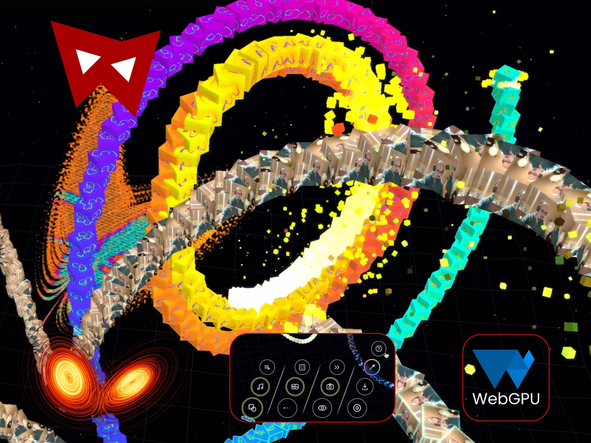

<p align="center">
  
</p>

# Lorenz Clash

**A WebGPU experience you are part of.**

Lorenz Clash is a generative audiovisual camera experience for the web. The front camera or webcam becomes visual matter: it is captured, sliced, stretched and dissolved along the 3D paths of two Lorenz attractors. Music analysis drives camera direction, rhythmic effects, exposure trails, pixel ripples and colour pulses, while the whole experience stays local to the device.



Live app: [lorenzclash.andrefrelicot.dev](https://lorenzclash.andrefrelicot.dev/)

Devlog article: [Lorenz Clash: building a WebGPU experience you're part of](https://andrefrelicot.dev/en/2026/06/lorenz-clash-a-webgpu-experience-you-are-part-of)

## Tech Stack

- TypeScript + Vite
- WebGPU + WGSL shaders
- Web Audio API for playback and FFT features
- Offline music-structure analysis with Python, librosa and scipy
- WebCodecs + mp4-muxer for local video export
- IndexedDB for local clip storage
- Progressive Web App manifest and service worker

## Requirements

Lorenz Clash requires a recent WebGPU-capable browser and a secure HTTPS connection for camera access on mobile devices. It is built as a static web app: there is no backend, no upload and no tracking.

Recommended devices: modern desktop Chrome/Edge, recent Android phones running Chrome on Android 12+, iPhone SE 2022 / iPhone 13 or newer, or iPad Pro 2018 or newer.

## Run Locally

```bash
pnpm install
pnpm dev
```

Vite runs on port `5173` and exposes the dev server on the local network. For phone testing, serve it through HTTPS so WebGPU and camera permissions work correctly.

## Build

```bash
pnpm build
pnpm preview
```

The production output is written to `dist/` and can be hosted as static files.

## Offline Audio Analysis

The runtime includes precomputed music structure in `src/audio/track-analysis.json`. Regenerate it after changing the audio tracks:

```bash
pnpm analyze:audio
```

The analysis script reads `public/audio/*.m4a`, extracts section boundaries, beats, kick/snare-like events and roll candidates, then writes a compact JSON timeline used by the Auto Director and rhythm-triggered visual effects.

## License

MIT
